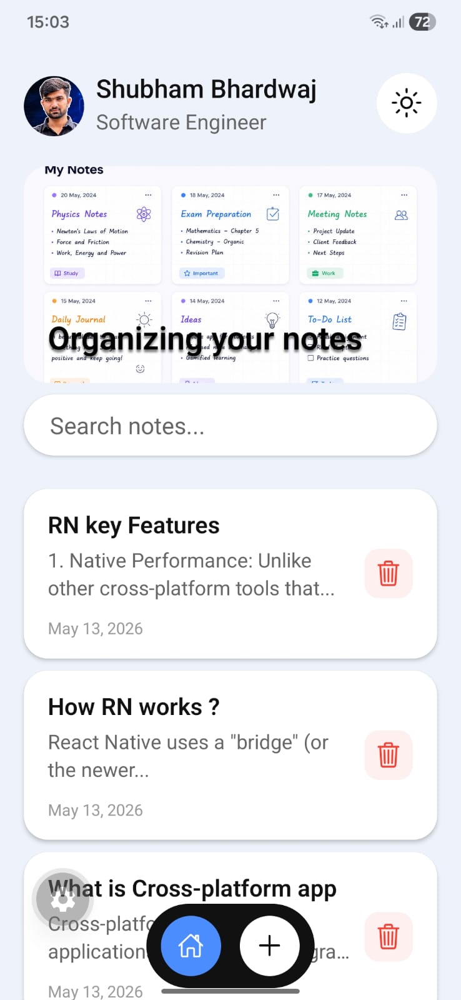
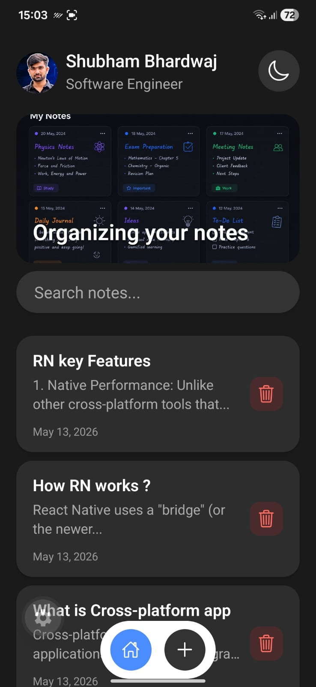
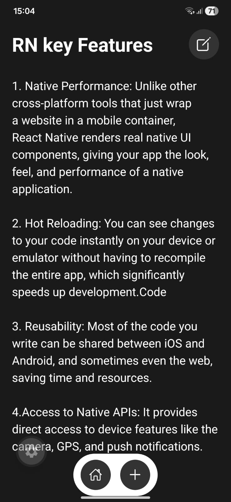
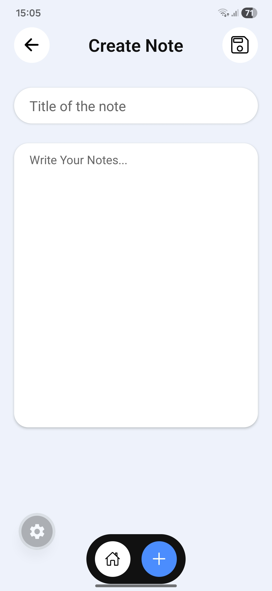
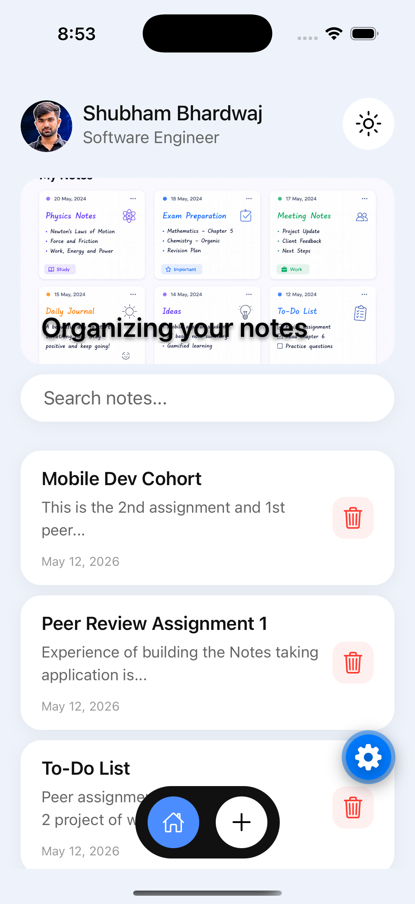
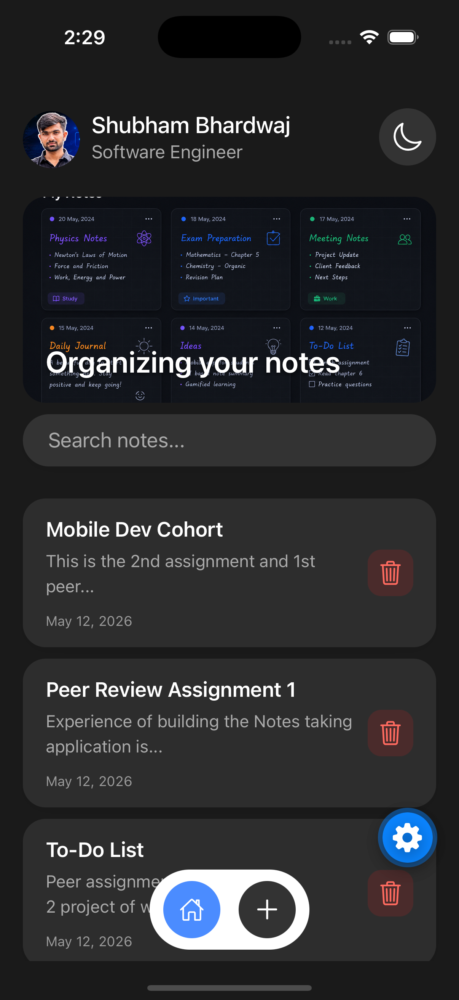
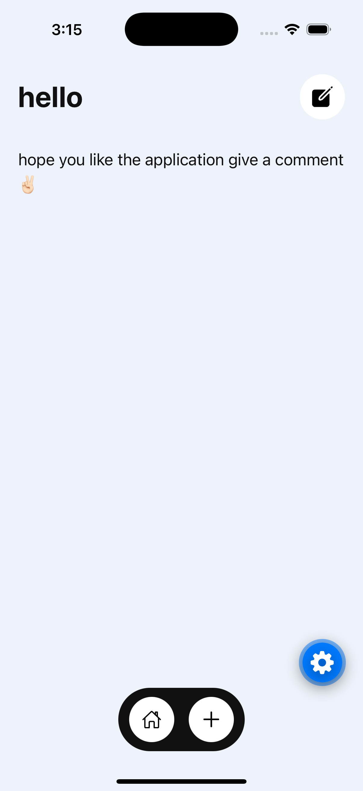
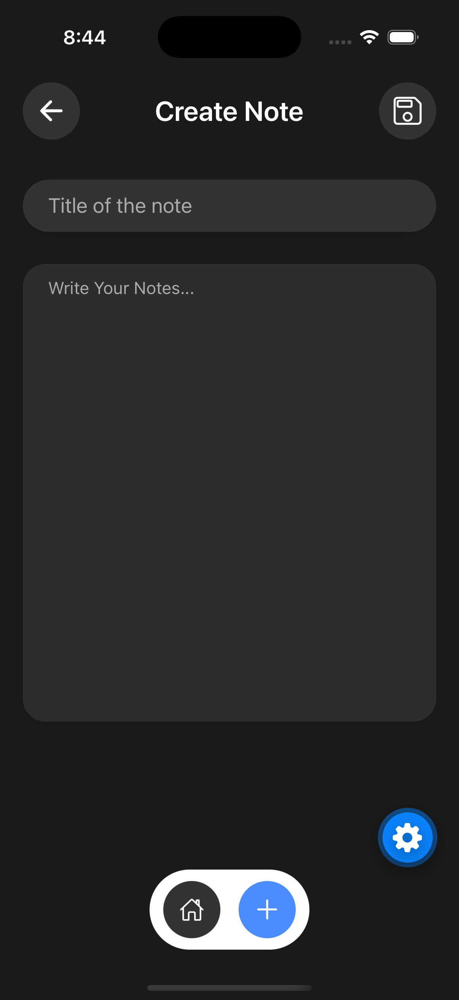

# 📝 Note Taking App


A beautiful, fully-featured Note Taking mobile application built with React Native and Expo. The app features a stunning, adaptive UI with seamless transitions between Light and Dark modes. 

## ✨ Key Features

- **Create & Manage Notes**: Effortlessly add, edit, and delete your notes.
- **Search Functionality**: A built-in search bar on the home screen allows you to find notes instantly.
- **Dynamic Theming**: First-class support for Light and Dark modes, leveraging the system's `useColorScheme()` to automatically adapt or manually toggle via a button.
- **Responsive Navigation**: A sleek, pill-shaped floating navigation bar allows you to switch between the Home view and the Create Note view.
- **Cross-Platform**: Optimized for both iOS and Android with platform-specific adjustments for keyboards and notches.

---

## 📸 Screenshots & Demos

### 📱 Android
| Home (Light) | Home (Dark) | Note View (Dark) | Create Note (Light) |
|:---:|:---:|:---:|:---:|
|  |  |  |  |

**▶️ Android Demo Video:** [Watch Video](assets/demo/android_screen_recoding.mp4)

### 🍎 iOS
| Home (Light) | Home (Dark) | Note View (Light) | Create Note (Dark) |
|:---:|:---:|:---:|:---:|
|  |  |  |  |

**▶️ iOS Demo Video:** [Watch Video](assets/demo/ios_screen_recoding.mov)

---

## 🧭 Navigation & Views

1. **Home View**: 
   - Displays a customized banner with an `ImageBackground`.
   - Features a Search Bar at the top.
   - Lists all created notes using a `FlatList` with individual `Card` components.
   - Includes a **Delete** button on each card.
   - A **Theme Toggle** button sits at the top right.
2. **Note View**: 
   - Accessible by tapping any note card.
   - Displays the full title and content.
   - Features an **Edit** button in the top right. Tapping it transforms the view into edit mode (changing the text to a `TextInput`) and changes the icon to a "Save" icon. Tapping Save commits your changes.
3. **Create Note View**:
   - Accessible via the floating `+` button in the pill navigation.
   - Provides a clean interface to draft new thoughts.

---

## 🛠️ Technical Details & Components

The application is built using standard React Native components to ensure high performance and a native feel:

- **Styling (`StyleSheet`)**: Uses `StyleSheet.create()` to isolate component styles. All styles are placed logically in the `src/styles/` folder so each component has its respective styling file (e.g., `home.ts` for the `Home` component).
  ```tsx
  // src/styles/home.ts
  export const getHomeStyles = (theme: any) => StyleSheet.create({
    headerBackground: {
      height: 180,
      borderRadius: 20,
      overflow: "hidden",
    },
  });
  ```

- **Data Persistence (`AsyncStorage`)**: Notes are saved locally on the device using `@react-native-async-storage/async-storage`. I created a robust `notesServices` module to handle all CRUD (Create, Read, Update, Delete) operations asynchronously. 
  
  **Logical Thinking:** Rather than placing storage logic directly inside UI components, I abstracted it into a dedicated service layer. This ensures the UI remains clean and the database logic is reusable. For example, when updating a note, I fetch the existing array, map over it to find the specific note ID, apply the edits immutably, and then save the entire array back to device storage:
  ```tsx
  // src/services/notes_storage.ts
  export const notesServices = {
    updateNote: async (id: string, title: string, description: string) => {
      try {
        // 1. Retrieve the existing notes string from storage
        const notes = await AsyncStorage.getItem("notes");
        
        // 2. Parse into a workable array, falling back to an empty array if null
        const parsedNotes: Notes[] = notes ? JSON.parse(notes) : [];
        
        // 3. Map over the array to locate and update the targeted note immutably
        const updatedNotes = parsedNotes.map((note) =>
          note.id === id ? { ...note, title, description } : note
        );
        
        // 4. Stringify and save the updated array back to device storage
        await AsyncStorage.setItem("notes", JSON.stringify(updatedNotes));
        return updatedNotes;
      } catch (error) {
        console.error("Error updating note:", error);
        return [];
      }
    },
    // ...other methods (saveNote, getNotes, deleteNote, searchNotes)
  };
  ```

- **`@expo/vector-icons`**: Utilized heavily for gorgeous, scalable vector iconography throughout the UI (e.g., the `Ionicons` package for settings, theme toggles, and UI interactions).

- **`ImageBackground`**: Used to render the beautiful banner image at the top of the Home screen with the text overlay *"Organizing your notes"*.
  ```tsx
  // src/components/home.tsx
  <ImageBackground
    source={
      colorScheme === "dark"
        ? require("../../assets/images/coverImageDarkMode.png")
        : require("../../assets/images/coverImage.png")
    }
    style={homeStyles.headerBackground}
  >
    <Text>Organizing your notes</Text>
  </ImageBackground>
  ```

- **Keyboard Management**: Uses iOS `automaticallyAdjustKeyboardInsets` and Android OS-level window resizing (plus conditionally `KeyboardAvoidingView`) to ensure that typing long notes or searching remains comfortable without the keyboard hiding your text.
  ```tsx
  // src/components/view_notes.tsx
  <KeyboardAvoidingView
    behavior="padding"
    enabled={Platform.OS === 'android' && isEditing}
  >
    <ScrollView automaticallyAdjustKeyboardInsets={true}>
      <TextInput multiline value={editContent} onChangeText={setEditContent} />
    </ScrollView>
  </KeyboardAvoidingView>
  ```

- **`Pressable`**: Used heavily for interactive elements like note cards, the floating pill navigation icons, and theme toggles. It allows customized opacity/feedback actions.
  ```tsx
  // src/components/home.tsx
  <Pressable style={homeStyles.Btn} onPress={toggleTheme}>
    <Ionicons
      name={colorScheme === "dark" ? "moon-outline" : "sunny-outline"}
      size={28}
      color={theme.icon}
    />
  </Pressable>
  ```

- **`TextInput`**: The core input method for searching, creating, and editing notes.
  ```tsx
  // src/components/home.tsx
  <TextInput
    placeholder="Search notes..."
    placeholderTextColor={theme.textSecondary}
    value={searchQuery}
    onChangeText={setSearchQuery}
    onSubmitEditing={() => handleSearch(searchQuery)}
    returnKeyType="search"
    style={homeStyles.searchInput}
  />
  ```

- **`FlatList`**: Ensures smooth scrolling and efficient memory usage when rendering the list of note cards.
  ```tsx
  // src/components/home.tsx
  <FlatList
    data={allNotes}
    keyExtractor={(item) => item.id}
    renderItem={({ item }) => (
      <Card
        title={item.title}
        description={item.description}
        date={item.createdAt}
        onDelete={() => handleDeleteNote(item.id)}
        onPress={() => onNotePress && onNotePress(item)}
      />
    )}
  />
  ```

### Code Snippet: Theming
The app relies heavily on `useColorScheme` to pick colors from a predefined theme palette:
```tsx
const colorScheme = useColorScheme();
const theme = Colors[colorScheme === "dark" ? "dark" : "light"];
// Passing the theme object to our stylesheet functions
const styles = viewNoteStyles(theme);
```

---

## 📁 Project Structure

```text
Notes_Taking/
├── assets/             # Images, fonts, and demo media
│   └── demo/           # Screenshots and demo videos
├── src/
│   ├── app/            # Main entry points and navigation handling
│   │   └── index.tsx   
│   ├── components/     # Reusable UI components (Card, Home, view_notes, create_notes)
│   ├── services/       # Async storage logic / Data fetching
│   ├── styles/         # Dedicated stylesheets for components (home.ts, view_note.ts, etc.)
│   └── utils/          # Helper files, including the Theme/Colors configuration
├── app.json            # Expo configuration
└── package.json        # Dependencies
```

---

## 📝 Future Roadmap

- [ ] Add rich text formatting (bold, italics, underlines)
- [ ] Implement note tagging and categorization features
- [ ] Integrate Cloud Sync functionality across multiple devices

---

## ⚙️ Prerequisites

Before you clone and run the project, ensure you have the following installed on your system:
* **Node.js** (v18 or higher)
* **npm** or **yarn**
* **Expo CLI** (`npm install -g expo-cli`)
* **Expo Go** application installed on your physical iOS or Android device (for live testing).

---

## 🚀 How to Clone and Run

1. **Clone the repository**
   ```bash
   git clone <your-repository-url>
   cd Notes_Taking
   ```

2. **Install Dependencies**
   ```bash
   npm install
   # or if you use yarn
   yarn install
   ```

3. **Start the Expo Server**
   ```bash
   npx expo start
   ```

4. **Run on your device/emulator**
   - Press **`a`** in the terminal to open on an Android emulator.
   - Press **`i`** in the terminal to open on an iOS simulator.
   - Or download the **Expo Go** app on your physical smartphone and scan the QR code displayed in your terminal.

---

## 👨‍💻 Author

**Shubham Bhardwaj** - *Software Engineer*

- 💼 **LinkedIn**: [www.linkedin.com/in/shubhamai](https://www.linkedin.com/in/shubhamai)
- 🕮 **X (Twitter)**: [@SharmaShub76868](https://x.com/SharmaShub76868)
